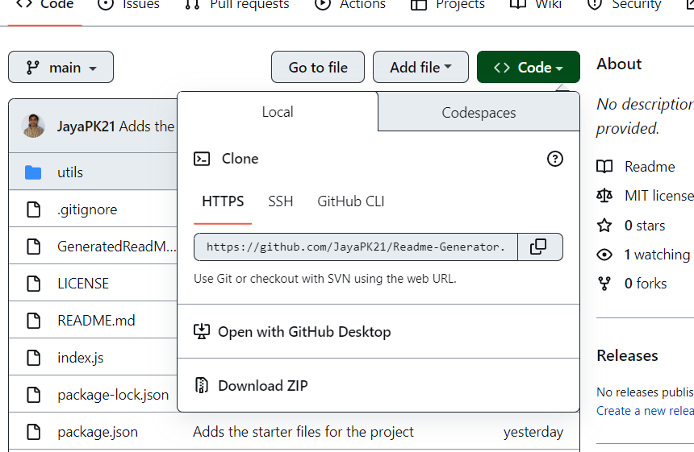
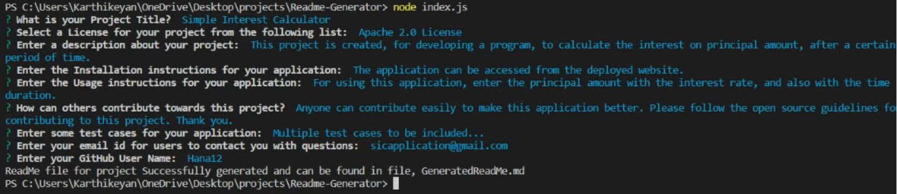

# Readme Generator

## Description

This application is used for generating a ReadMe file for all projects. The application accepts a series of user inputs from the command line, and generates a ReadMe file dynamically with all the given user information. Inquirer module from the Node packages is used to get the user inputs from the command line. The 'fs' module is used for writing the contents of ReadMe to a markdown file, which is saved in the root folder.

The user can easily access the generated ReadMe file and add it to their specific projects.

## Installation

The required files for the application can be downloaded to the user's machine by following the steps below:

1. Go to the [Application GitHub](https://github.com/JayaPK21/Readme-Generator) repository.
2. Click on 'Code' and 'Download ZIP' as shown on the following screenshot.

3. Extract the files into your local repository.
4. Run 'npm install' in the command line from the path where the files have been extracted to.

The application has been installed on your local machine and is ready to be used.

## Usage

Open the command line and go to the file directory where the application has been installed.

Run 'node index.js' from the application directory.

Answer all the questions to the command line prompts.

A ReadMe file gets generated for your specified project, and is stored in the 'GeneratedReadMe.md' file.

Following is a screenshot of a sample command line inputs to the application:

## License

This project uses [MIT](https://opensource.org/licenses/MIT) Licence.